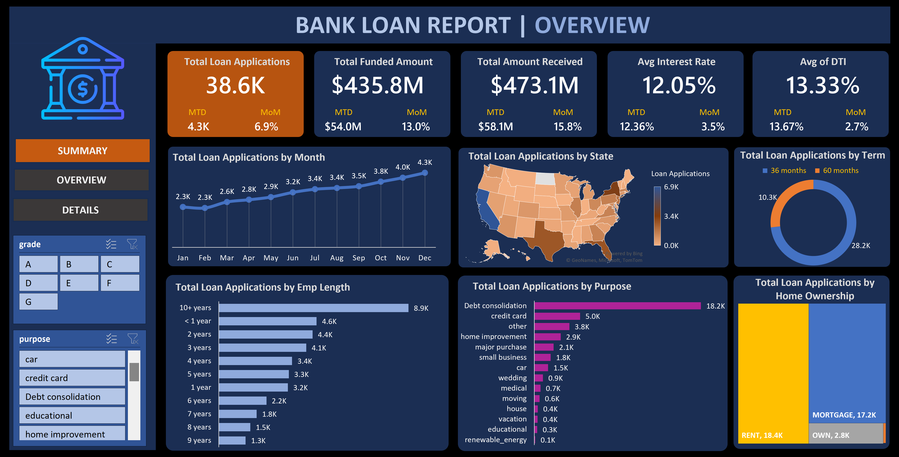
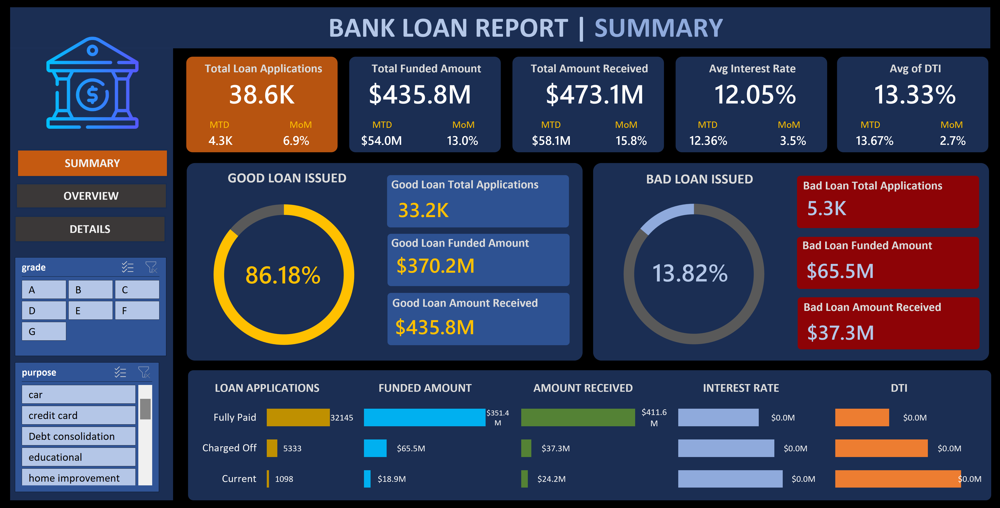

# 🏦 Bank Loan Dashboard (Excel Project)

A fully interactive and professional **Bank Loan Analysis Dashboard** built entirely using **Microsoft Excel**.  
This project visualizes financial KPIs, borrower demographics, and loan performance to support better decision-making in lending and risk management.

---

## 📊 Dashboard Highlights:

- **Total Loan Applications:** 38.6K  
- **Total Funded Amount:** $435.8M  
- **Total Amount Received:** $473.1M  
- **Average Interest Rate:** 12.05%  
- **Average DTI (Debt-to-Income):** 13.33%  

### 📈 Performance Breakdown:
- **Good Loans Issued:** 86.18% (33.2K applications)
- **Bad Loans Issued:** 13.82% (5.3K applications)

### 🔍 Segment-wise Analysis:
- **Loan Purpose:** Debt consolidation, Credit card, Home improvement, etc.
- **Loan Terms:** 36 months vs. 60 months
- **Employment Length:** Majority 10+ years
- **Home Ownership:** Rent (18.4K), Mortgage (17.2K), Own (2.8K)
- **Geographic Spread:** State-wise application distribution
- **Loan Trends by Month** for the full year

---

## 🛠 Tools & Techniques Used:

- Microsoft Excel
  - Pivot Tables
  - Power Query (for data transformation)
  - Slicers and form controls
  - Conditional Formatting
  - KPI Metrics
  - Charting and Layout Design

---

## 📸 Dashboard Snapshots:

### 🧭 Overview Dashboard

### 📘 Summary Dashboard

---

## 📂 Project Files

| File | Description |
|------|-------------|
| `BankLoanDashboard.xlsx` | Main Excel dashboard file |
| `Overview_BankLoan.png` | Screenshot of Overview section |
| `Summary_BankLoan.png` | Screenshot of Summary section |

---

## 🙌 Feedback & Contribution

**Feedback is welcome!**  
Feel free to open an issue or share suggestions for improvement.  
If you found this project useful or inspiring, don't forget to ⭐ star the repo!

---

## 📬 Connect with Me

Let’s connect and collaborate!

- [LinkedIn – Karishma Sawant](https://www.linkedin.com/in/karishmaasawant)

---

## 🏷 Tags

`#ExcelDashboard` `#BankLoanAnalysis` `#FinancialAnalytics` `#KPITracking` `#InteractiveDashboard` `#CreditRisk` `#DataVisualization`
